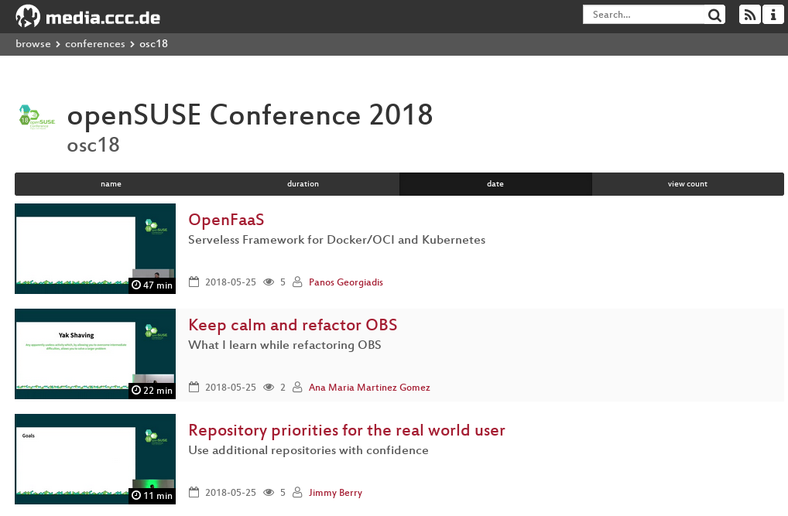
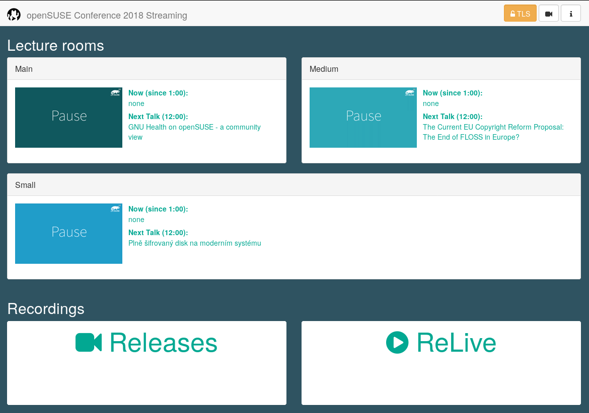
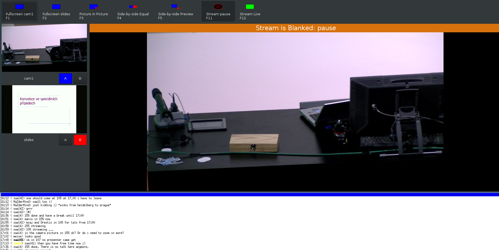
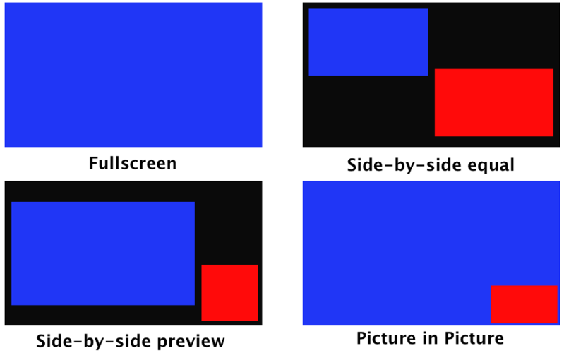

## who?

--

## who?

* danimo
* mcaj
* mstrigl
* tampakrap
* thomic
* you?

--

## what?

#### media.ccc.de

--

## what?

#### streaming.media.ccc.de

--

## what?

#### youtube.com/opensuse

--

## how?

#### camera

Note:
* Source: https://www.teltec.de/jvc-gy-hm200e.html

--

## how?

#### camera - facts

* Focus ring - to adjust the sharpness of the camera
* Zoom button - to zoom in and zoom out
* Don't touch anything else, if not asked - srsly!

--

## how?

#### tripod

Note:
* Source: https://www.teltec.de/sachtler-ace-m-ms-stativ-system.html

--

## how?

#### tripod - facts

* variable resistance for "smooth" sliding to left/right + up/down
* Tilt axis: up/down
* Pan axis: left/right

--

## how?

#### cube

Note:
* Source: https://www.caseking.de/bitfenix-colossus-m-mini-itx-gehaeuse-red-blue-green-led-schwarz-gebf-116.html

--

## how?

#### Zidoo X9

Note:
* Source: https://www.zidoo.tv/Product/index/model/X9/target/rdOqbsJTP8k%3D.html

--

## how?

#### Winkekatze

Note:
* Source: https://www.amazon.de/dp/B00OV7WV8C

--

## how?

#### voctomix
#### https://github.com/voc/voctomix

Note:
* Source: danimo

--

## how?

#### voctomix - composition modes

Note:
* Source: https://github.com/benjaminwand/Engelschulung/blob/master/Engelschulung.pdf

--

## how?

#### a small "yatebox" as telephony server

--

## what's your business?

#### before the talk

* be on time
* get known to eachother
* help eachother and share your knowledge
* help the speaker with the setup of the laptop
* help the speaker with the setup of the microphone
* check the hardware and signals
* set the stream LIVE "F12" or "green button" in the gui
* in case that anything happens: CALL 4200 (video office)

--

## what's your business?

#### during the talk

* talk to eachother if something is wrong
* show slides immediately after the speaker showed them
* read slides twice for yourself (calm & slowly)
* don't film the audience
* we record talks, not action movies ;)
* try to get a microphone in the audience, if there are questions
* in case that anything happens: CALL 4200 (video office)

--

## what's your business?

#### after the talk

* help the speaker to get rid of the microphone
* help the speaker to disconnect the laptop
* say "thanks" to eachother because you did an awesome job!
* give some feedback to the video office (find us in 302) - if anything happens
* as always, if somethings breaks, CALL 4200

---

## Thank you for your attention :)

--

## Sources

* see notes

--

## Copyright
* Copyright and licenses of the used graphics - as stated in the graphics
* Licenses of the source materials - as stated in the source links.
* To this presentation LICENSE file of the repository applies.
